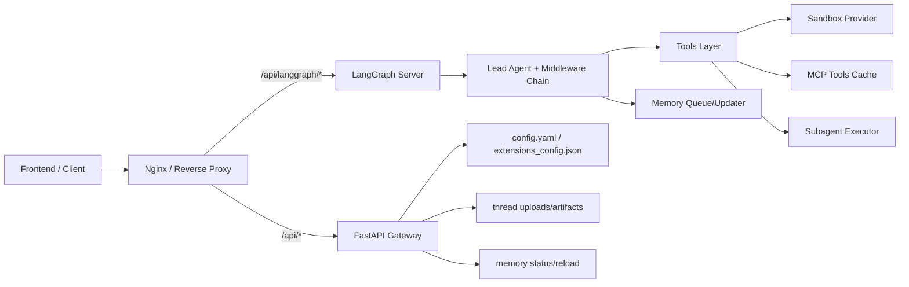
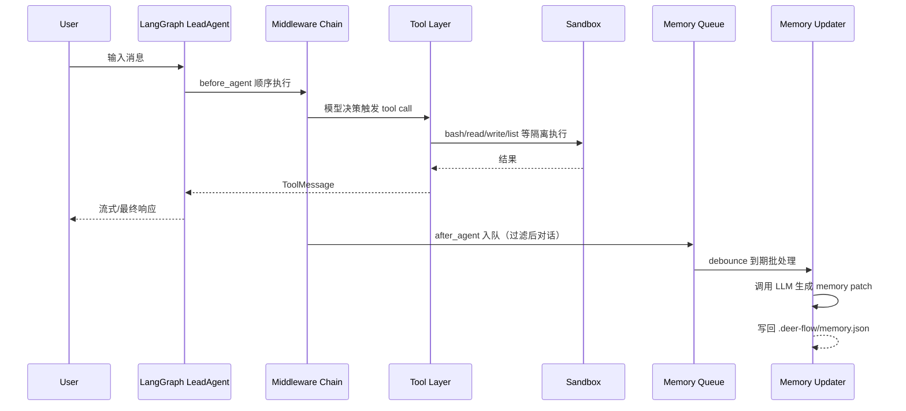

# DeerFlow 后端智能体架构深度技术总结

> 目标：基于当前仓库 `backend/` 的真实代码实现，提炼可复用的 Agent 架构模式，并给出迁移到 Java Spring AI / LangGraph4j 的落地建议。

---

## 0. 分析边界与说明

- 本文基于当前项目真实结构分析（`src/agents`、`src/gateway`、`src/sandbox`、`src/subagents`、`src/mcp`、`src/skills` 等）。
- 你示例中的模块名（如 `backend-al-simulation`、`backend-train-simulate-core`）**不在当前仓库中**，因此本文按实际目录给出等价分析。
- 当前后端是“**双进程后端**”：
  - `LangGraph Server`（对话/智能体执行面）
  - `FastAPI Gateway`（配置与管理面）

---

## 1. 架构设计概览

### 1.1 模块划分与职责边界

| 模块 | 主要职责 | 对外/对内接口 |
|---|---|---|
| `src/agents` | Lead Agent 组装、middleware 链、线程状态定义、记忆触发 | LangGraph graph 入口 `make_lead_agent` |
| `src/gateway` | 管理类 REST API：models/mcp/skills/memory/uploads/artifacts | HTTP REST (`/api/*`) |
| `src/sandbox` | 命令执行与文件访问隔离抽象（本地/容器 provider） | `Sandbox` 抽象 + 工具适配 |
| `src/tools` | 工具发现与组合（配置工具 + 内置工具 + MCP 工具） | `get_available_tools()` |
| `src/subagents` | 子智能体注册、并发执行、超时与状态管理 | `task` 工具调用入口 |
| `src/mcp` | MCP server 配置解析、工具拉取、缓存与热更新 | `langchain-mcp-adapters` 集成 |
| `src/skills` | 技能扫描/解析/启停状态读取，技能提示词注入 | `load_skills()` |
| `src/models` | 多模型工厂、运行时反射实例化、tracing 挂载 | `create_chat_model()` |
| `src/config` | 统一配置中心（YAML + env + 扩展配置） | `get_app_config()` |

### 1.2 两个后端进程的交互方式



### 1.3 架构风格与通信模式

- **主风格**：模块化单体（Modular Monolith）+ 双进程职责分离。
- **接口风格**：RESTful（Gateway）+ LangGraph 流式 Agent 运行（SSE 友好）。
- **RPC / MQ**：当前未采用 gRPC、Kafka、RabbitMQ、Celery。
- **并发模型**：Python 线程池 + 轮询状态（子智能体）、`threading.Timer` 防抖（记忆更新）。

### 1.4 数据流与依赖关系



---

## 2. 智能体核心设计模式

### 2.1 Agent 生命周期管理

**模式：工厂构建 + 中间件生命周期钩子 + 惰性资源获取**

- 定义与初始化：`make_lead_agent(config)` 统一创建模型、工具、提示词和中间件。
- 运行：LangGraph 在每轮执行中维护 `ThreadState`，并驱动工具调用循环。
- 销毁/回收：沙盒不在每轮释放，走 provider 级生命周期，降低频繁创建销毁成本。
- 关键点：`ThreadDataMiddleware` 与 `SandboxMiddleware` 都支持 `lazy_init=True`，实现按需创建。

### 2.2 状态管理（对话状态/任务状态）

**模式：显式状态 schema + reducer 合并策略 + 线程隔离目录**

- `ThreadState` 承载：`sandbox`、`thread_data`、`artifacts`、`todos`、`uploaded_files`、`viewed_images`。
- 通过 reducer 函数处理多步追加：如 `artifacts` 去重合并、`viewed_images` 增量或清空。
- 每个 thread 映射独立目录：`.deer-flow/threads/{thread_id}/user-data/{workspace,uploads,outputs}`。

### 2.3 工具/函数调用设计

**模式：配置驱动 + 能力分层 + 条件暴露**

- 配置工具：从 `config.yaml` 动态解析类路径。
- 内置工具：`present_file`、`ask_clarification`、`view_image`、`task`。
- 外部工具：MCP tools 按 extensions 配置动态加载。
- 条件暴露：根据模型是否支持 vision 决定是否注入 `view_image`。

### 2.4 记忆机制（短期/长期）

**模式：短期上下文留在会话状态，长期记忆异步提炼持久化**

- 短期记忆：当前线程消息 + `ThreadState`。
- 长期记忆：`MemoryMiddleware` 在 `after_agent` 过滤消息后入队。
- 异步更新：`MemoryUpdateQueue` 使用 debounce 合并写入，`MemoryUpdater` 调 LLM 生成结构化更新。
- 持久层：JSON 文件 `.deer-flow/memory.json` + mtime 缓存失效。

### 2.5 规划与推理

**模式：Prompt 约束 + 可选 Todo middleware + 可选 Summarization middleware**

- Prompt 中显式规定“先澄清后执行”“子任务并发上限”。
- plan mode 可启用 `TodoListMiddleware`（复杂任务状态跟踪）。
- 长上下文场景可启用 `SummarizationMiddleware` 进行上下文压缩。

### 2.6 多智能体协作

**模式：主智能体编排 + 子智能体隔离执行 + 结果回传聚合**

- 主智能体通过 `task` 工具委派给 `general-purpose` 或 `bash` 子智能体。
- `SubagentExecutor` 使用线程池后台执行，并维护任务状态（`PENDING/RUNNING/COMPLETED/FAILED/TIMED_OUT`）。
- 子智能体共享父线程的 `sandbox/thread_data`，避免上下文与文件系统割裂。

---

## 3. 关键技术实现要点

### 3.1 AI 模型集成方式

- 使用 LangChain/LangGraph 作为统一抽象。
- `create_chat_model()` 基于配置动态反射实例化模型（OpenAI/DeepSeek 等）。
- 支持 `thinking_enabled`、vision 能力分流。
- 可挂 LangSmith tracing（环境变量控制）。

### 3.2 异步处理机制

- 子智能体执行：`ThreadPoolExecutor`（调度池 + 执行池）+ 状态表 + 轮询。
- 记忆更新：`threading.Timer` + 防抖队列批处理。
- 说明：当前为**进程内异步**，并非分布式任务队列。

### 3.3 数据库/向量库现状

- 当前项目未看到关系型数据库、向量数据库的核心接入。
- 关键状态存储以文件和内存为主：
  - 长期记忆：JSON 文件
  - 扩展配置：JSON 文件
  - 线程产物/上传：文件系统

### 3.4 缓存策略

- 应用配置、扩展配置：单例缓存 + reload/reset。
- MCP 工具缓存：基于配置文件 mtime 失效重载。
- 记忆缓存：基于 memory 文件 mtime 自动失效。

### 3.5 文件处理机制

- 上传目录按 thread 隔离。
- PDF/PPT/Word/Excel 等上传后可转换为 Markdown（`markitdown`）。
- 通过 `/api/threads/{thread_id}/artifacts/{path}` 安全访问（路径穿越检查）。
- 沙盒内使用虚拟路径 `/mnt/user-data/*`，本地 provider 动态映射到真实路径。

### 3.6 错误处理与重试

- API 层：标准 `HTTPException` + 400/403/404/500 语义。
- 工具层：捕获 `SandboxError` 及兜底异常，返回工具可消费错误字符串。
- 子智能体：超时状态单独建模，轮询超时作为兜底。
- 记忆更新：失败不阻塞主流程（降级为日志输出）。

### 3.7 日志与监控

- 网关统一 `logging.basicConfig`。
- 关键流程输出 trace_id（尤其子智能体执行）。
- 可选 LangSmith tracing：模型回调自动注入。

---

## 4. 面向 Spring AI / LangGraph4j 的映射与建议

### 4.1 概念映射表

| DeerFlow（Python） | Spring AI / Java 对应概念 | 迁移建议 |
|---|---|---|
| `make_lead_agent` + middleware chain | `Advisor` 链 + `ChatClient` + orchestration service | 把中间件拆成可组合 Advisor/Interceptor |
| `ThreadState` TypedDict | 强类型 POJO/Record + `ConversationContext` | 用 Jackson + schema version 管理演进 |
| `get_available_tools()` | Spring AI `@Tool` / Function Calling registry | 做 Tool Registry + capability gating |
| `MemoryMiddleware + Queue + Updater` | `ChatMemory` + Async summarizer worker | 将记忆更新异步化，避免阻塞主调用 |
| `SubagentExecutor` | LangGraph4j 子图/并发节点 或 Reactor 任务编排 | 用受控并发 + timeout + backpressure |
| `Sandbox Provider` 抽象 | Java `CommandExecutionService` SPI | 本地执行与容器执行实现解耦 |

### 4.2 Java 生态需要调整的点

1. **并发模型**：
   - Python 线程池轮询 -> Java 建议 `CompletableFuture` + `ScheduledExecutorService` 或 Reactor。
2. **配置系统**：
   - YAML 自定义解析 -> `@ConfigurationProperties` + Spring Profiles + Vault/Config Server。
3. **可观测性**：
   - `print/logging` 为主 -> Micrometer + OpenTelemetry + structured logging。
4. **内存态缓存**：
   - 进程内缓存 -> 多实例部署时建议 Redis/Caffeine 分层缓存。
5. **持久化**：
   - JSON 文件 -> 建议关系库（会话、任务、审计）+ 向量库（长期语义记忆）。

### 4.3 推荐的 Spring Boot 替代实现

| 当前实现 | Java 推荐 |
|---|---|
| `ThreadPoolExecutor` 子任务执行 | `TaskExecutor` + `@Async` + `CompletableFuture` |
| 文件 memory.json | PostgreSQL + JSONB（结构化记忆） |
| MCP mtime 缓存 | Redis key version + 本地 Caffeine |
| HTTPException | `@ControllerAdvice` + 统一错误码 |
| 路径字符串拼接 | `java.nio.file.Path` + 白名单根目录校验 |

### 4.4 Java 性能与并发最佳实践

- 子任务池分离：编排线程池与执行线程池分离（当前 Python 已体现该思想）。
- 限流与隔离：按租户/线程 ID 限制并发子任务数。
- IO 与 CPU 分池：模型调用、文件处理、命令执行分离线程池。
- 超时分级：模型超时、工具超时、总链路超时三层控制。
- 幂等与重试：只对幂等操作自动重试；非幂等操作引入补偿机制。

---

## 5. 代码级分析（核心片段）

### 5.1 Agent 工厂与中间件链（生命周期入口）

```python
# src/agents/lead_agent/agent.py (简化)
def make_lead_agent(config):
    return create_agent(
        model=create_chat_model(...),
        tools=get_available_tools(...),
        middleware=_build_middlewares(config),
        system_prompt=apply_prompt_template(...),
        state_schema=ThreadState,
    )
```

设计要点：
- 工厂方法统一装配，避免入口散乱。
- `state_schema` 显式声明，确保上下游一致。
- middleware 顺序可控，适合表达跨切面约束（如“澄清必须最后”）。

### 5.2 抽象接口设计（Python ABC ↔ Java Interface）

```python
# src/sandbox/sandbox_provider.py (简化)
class SandboxProvider(ABC):
    @abstractmethod
    def acquire(self, thread_id: str | None = None) -> str: ...
    @abstractmethod
    def get(self, sandbox_id: str) -> Sandbox | None: ...
    @abstractmethod
    def release(self, sandbox_id: str) -> None: ...
```

Java 对应：

```java
public interface SandboxProvider {
    String acquire(String threadId);
    Optional<Sandbox> get(String sandboxId);
    void release(String sandboxId);
}
```

该抽象使“本地执行”和“容器执行”可以无侵入替换。

### 5.3 工具接口与子智能体委派

```python
# src/tools/builtins/task_tool.py (简化)
@tool("task")
def task_tool(runtime, description, prompt, subagent_type, ...):
    config = get_subagent_config(subagent_type)
    executor = SubagentExecutor(config=config, tools=tools, ...)
    task_id = executor.execute_async(prompt, task_id=tool_call_id)
    # 后端轮询直到完成/失败/超时
```

设计要点：
- 把“委派控制流”封装成一个工具，主智能体只负责策略，执行细节由 executor 接管。
- 通过 `tool_call_id` 做可追踪任务 ID，便于日志与前端事件关联。

### 5.4 依赖注入与配置管理

- 当前模式：模块级单例 getter（`get_app_config()`、`get_sandbox_provider()`）。
- 优势：简单直接。
- Java 迁移建议：
  - 使用 Spring IoC 容器替代模块单例。
  - `@ConfigurationProperties` 管理配置。
  - provider、registry、executor 统一交给 Bean 生命周期托管。

### 5.5 测试策略观察

- 当前仓库测试较少（示例：`tests/test_title_generation.py`）。
- 建议补齐：
  1. middleware 顺序与副作用测试
  2. `task` 工具超时/失败路径测试
  3. sandbox 路径映射安全测试（路径穿越）
  4. memory updater 的 schema 合法性测试
  5. Gateway API 合约测试（OpenAPI + 示例响应）

---

## 6. 总结与迁移路线图

### 6.1 当前项目优势

1. **边界清晰**：推理面（LangGraph）与管理面（Gateway）分离。
2. **扩展性好**：工具体系支持本地工具、MCP、子智能体。
3. **状态显式**：`ThreadState` 与目录隔离机制明确。
4. **工程可演进**：配置驱动 + provider/registry 抽象，便于替换实现。

### 6.2 可改进点

1. 记忆与任务状态主要是文件/内存，分布式部署一致性不足。
2. 子智能体执行采用轮询，可优化为事件驱动或消息队列。
3. 测试覆盖面偏薄，建议增加回归与压力测试。
4. 观测面可进一步标准化（Metrics/Tracing/Logs 三件套）。

### 6.3 Python 到 Java 的注意事项

- 不要直接“语法级翻译”，优先迁移“模式”：
  - middleware/advisor 链
  - provider SPI
  - state schema + reducer
  - 工具注册与能力门控
  - 子智能体编排与受控并发
- 明确线程模型差异：Java 更适合结构化并发与线程池治理。
- 明确部署模型：单实例可用本地缓存，多实例需引入共享存储与分布式锁。

### 6.4 推荐技术栈（Java 版）

- **应用框架**：Spring Boot 3.x
- **AI 编排**：Spring AI + LangGraph4j（按复杂度二选一或混合）
- **并发**：Reactor / CompletableFuture + 自定义线程池
- **持久化**：PostgreSQL（会话/任务/记忆） + Redis（缓存/会话态）
- **向量检索**：pgvector / Milvus / Weaviate（长期语义记忆）
- **观测**：Micrometer + Prometheus + Grafana + OpenTelemetry
- **文件与对象存储**：S3/MinIO（替代本地文件系统，便于扩展）

---

## 附：给 Spring AI/LangGraph4j 的最小可行落地步骤（建议）

1. 先做单 Agent：实现 `AgentOrchestratorService` + Tool Registry + Memory Store。
2. 再加中间件链：把“线程目录隔离、澄清、标题、记忆入队”抽成 Advisor。
3. 再加子智能体：先支持 1 种 subagent，再扩展并发策略与超时治理。
4. 最后接入外部工具生态：MCP/HTTP 工具统一接入，补可观测与测试。

> 关键原则：优先复制架构边界与控制流，不要先复制全部功能细节。
