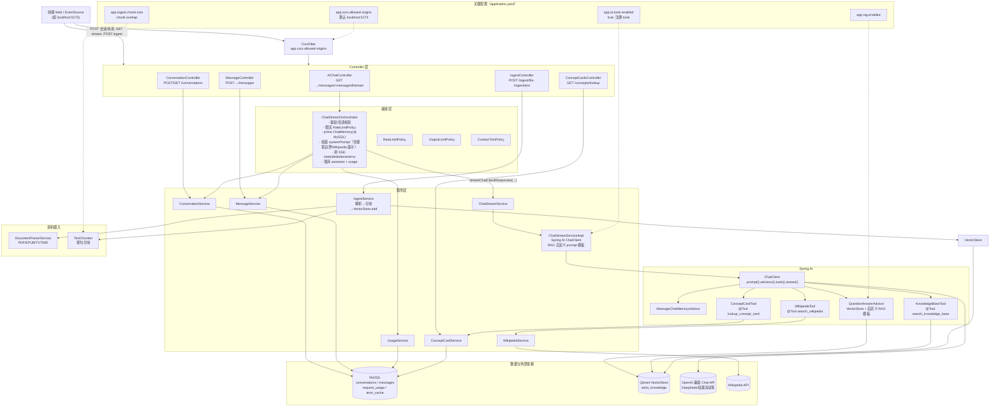
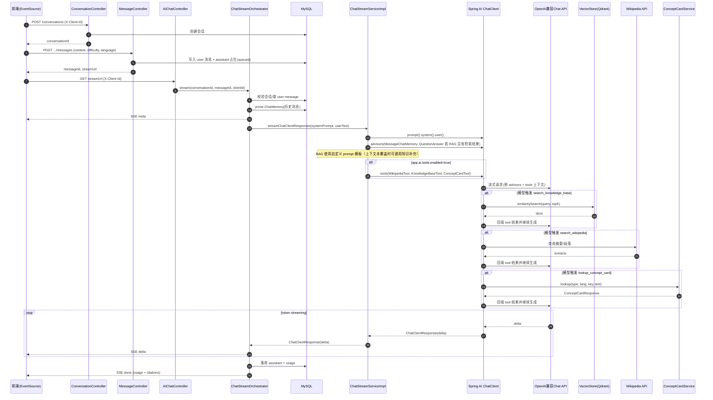

# AstroGuide 后端整体架构图（当前实现）

> 目标：用一张图看清“请求如何进来 → SSE 如何流式输出 → Spring AI 如何托管 Tool Calling → 资料摄入与数据/外部依赖在哪里”。

## 1) 组件视图（Component / Container）

## 2) 主链路时序图（会话 → 提交消息 → SSE 流式 + Tool Calling）

## 3) 你在代码里看“主链路”的推荐入口

- **API 入口**：
  - 会话：ConversationController（POST/GET /api/v0/conversations）
  - 消息：MessageController（POST .../messages）
  - SSE 流：AIChatController（GET .../messages/{messageId}/stream）
  - 资料摄入：IngestController（POST /api/v0/ingest/file, /ingest/text）
  - 概念卡：ConceptCardsController（GET /api/v0/concepts/lookup）
- **编排**（SSE、落库、usage/citations）：`ai/orchestrator/ChatStreamOrchestrator.java`
- **Spring AI**（advisors + 自定义 RAG 模板、tools 注册）：`service/impl/ChatStreamServiceImpl.java`
- **Tools**：`ai/tools/WikipediaTool.java`、`KnowledgeBaseTool.java`、`ConceptCardTool.java`
- **资料摄入**：`service/IngestService.java`、`ingest/parser/`、`ingest/TextChunker.java`
- **跨域**：`config/CorsConfig.java`（CorsFilter，app.cors.allowed-origins）

> 备注：SSE 不额外输出 tool_call/tool_result 过程事件；RAG 使用自定义 prompt 模板，上下文未覆盖时允许模型用通用知识补充并标注来源。
