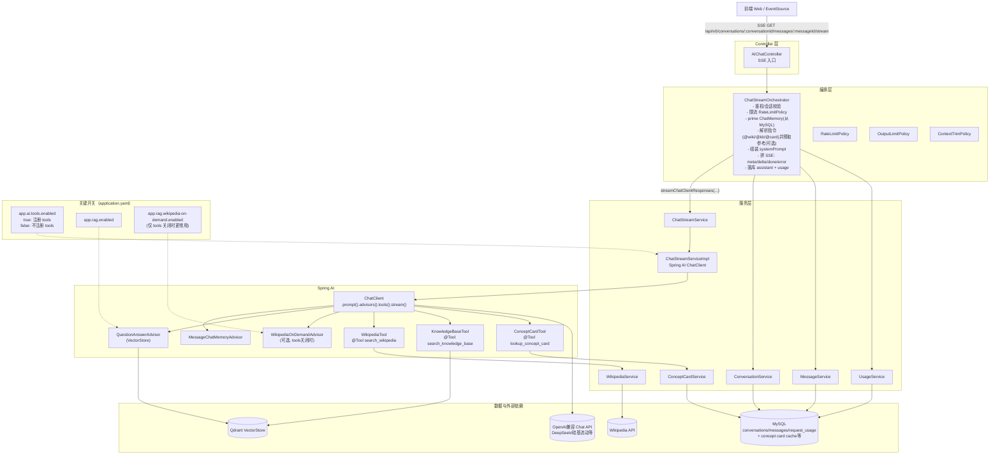
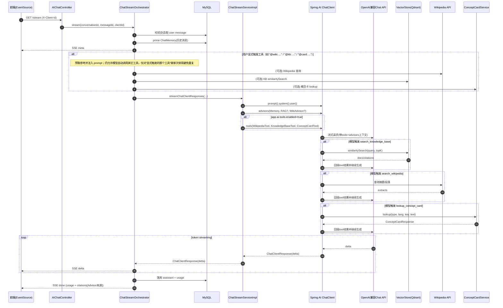

# AstroGuide 后端整体架构图（当前实现）

> 目标：用一张图看清“请求如何进来 → SSE 如何流式输出 → Spring AI 如何托管 Tool Calling → 数据/外部依赖在哪里”。

## 1) 组件视图（Component / Container）

## 2) 主链路时序图（SSE Streaming + Tool Calling）

## 3) 你在代码里看“主链路”的推荐入口

- SSE 入口：src/main/java/com/imperium/astroguide/controller/AIChatController.java
- 编排（SSE、落库、usage/citations）：src/main/java/com/imperium/astroguide/ai/orchestrator/ChatStreamOrchestrator.java
- Spring AI 调用点（advisors/tools 注册）：src/main/java/com/imperium/astroguide/service/impl/ChatStreamServiceImpl.java
- Tools：
  - src/main/java/com/imperium/astroguide/ai/tools/WikipediaTool.java
  - src/main/java/com/imperium/astroguide/ai/tools/KnowledgeBaseTool.java
  - src/main/java/com/imperium/astroguide/ai/tools/ConceptCardTool.java

> 备注：当前实现为了“干净稳定”，SSE 不额外输出 tool_call/tool_result 过程事件；如你希望前端看到工具调用过程，我们可以在下一步加“可选的观测增强（日志/拦截/自定义事件）”。
> 用户在前端页面输入问题后，前端会先用带有 X-Client-Id 请求头的 HTTP 请求创建会话（POST /api/v0/conversations，可选带标题），拿到 conversationId 之后再把用户问题提交到该会话下（POST /api/v0/conversations/{conversationId}/messages），后端在这个提交接口里会把用户消息写入 MySQL，同时创建一条“assistant 占位消息”（状态为 queued），并返回给前端一个用于拉取流式回答的 streamUrl；随后前端用 EventSource 或类似 SSE 客户端去访问 GET /api/v0/conversations/{conversationId}/messages/{messageId}/stream，请求进入 AIChatController 后会交给 ChatStreamOrchestrator 统一编排：它先校验会话与消息归属关系、读取本次 user message 的难度和语言等字段，然后把该会话的历史消息从 MySQL “灌入”到 ChatMemory（注意 MySQL 仍是权威来源，ChatMemory 只是为了让 Spring AI 的 MemoryAdvisor 在本次生成时注入上下文），接着根据配置开关决定本次请求是否启用 RAG（向量检索）、是否启用 Wikipedia on-demand advisor、以及是否启用 tool calling；在准备就绪后，编排层会先向前端发出一条 meta 类型的 SSE 事件（包含 requestId、model、difficulty、language 等元信息），并把 assistant 占位消息状态更新为 streaming，然后调用 ChatStreamServiceImpl.streamChatClientResponses(...) 正式开始让 Spring AI 生成回答：在这个方法里会构建 ChatClient.prompt()，设置 system prompt 和 user 文本，按需设置 max tokens，并把 advisors 组装进去（例如 MessageChatMemoryAdvisor 负责把历史对话注入、QuestionAnswerAdvisor 负责在生成时把向量检索结果注入到上下文、WikipediaOnDemandAdvisor 在 tools 关闭时可以用“改写/增强用户消息”的方式注入维基信息），如果本次启用了 tool calling，则会把 WikipediaTool、KnowledgeBaseTool、ConceptCardTool 通过 promptSpec.tools(...) 注册给这次对话；从这一刻开始，“是否调用工具、调用哪个工具、用什么参数”是由模型在生成过程中基于用户意图自行决定的，Spring AI 会在模型输出 tool call 时自动执行对应的 @Tool 方法，把工具返回结果回填给模型再继续生成，最终形成连续的自然语言输出；生成过程中，ChatClient 会以流式方式不断产出 ChatClientResponse，编排层从每个 response 中提取增量文本（delta），把每段增量以 delta 类型 SSE 事件持续推送给前端，同时累计完整回答文本，并且在流的过程中捕获 advisor 写入到 response context 的检索文档（例如 RAG 或 Wikipedia advisor 的 retrieved documents）用于稍后生成 citations；当模型结束输出后，编排层会计算耗时与 token 估算，合并生成 citations（如果启用了 RAG/Wiki/tool 的引用来源），把最终 assistant 内容与 usage 统计写回 MySQL（并记录 request_usage），最后再向前端发送一条 done 类型 SSE 事件，携带最终状态、usage 以及 citations，前端收到 done 后关闭流式展示并把本次回答作为完整消息呈现给用户。
