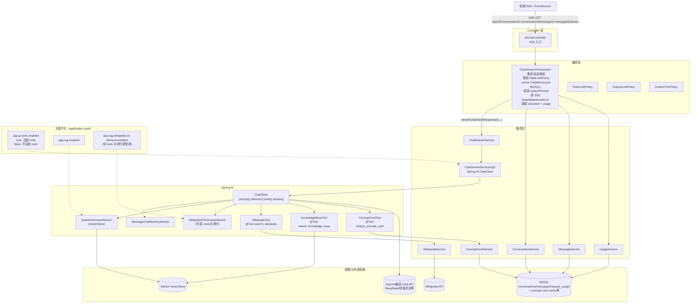
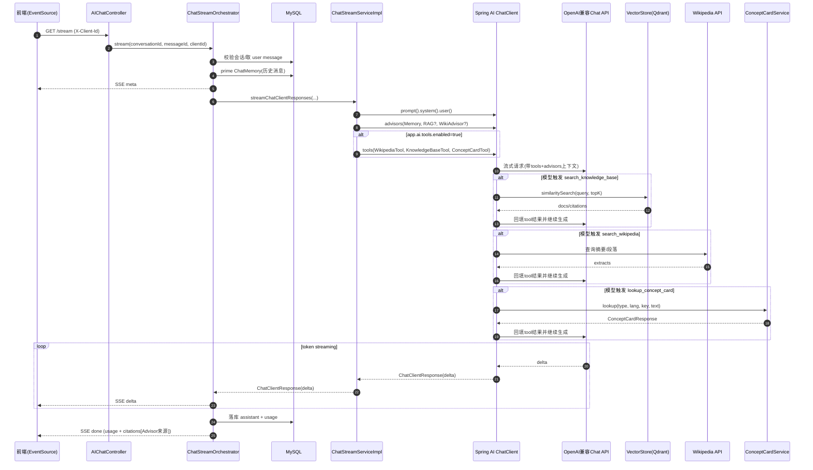

# AstroGuide 后端整体架构图（当前实现）

> 目标：用一张图看清“请求如何进来 → SSE 如何流式输出 → Spring AI 如何托管 Tool Calling → 数据/外部依赖在哪里”。

## 1) 组件视图（Component / Container）

## 2) 主链路时序图（SSE Streaming + Tool Calling）

## 3) 你在代码里看“主链路”的推荐入口

- SSE 入口：src/main/java/com/imperium/astroguide/controller/AIChatController.java
- 编排（SSE、落库、usage/citations）：src/main/java/com/imperium/astroguide/ai/orchestrator/ChatStreamOrchestrator.java
- Spring AI 调用点（advisors/tools 注册）：src/main/java/com/imperium/astroguide/service/impl/ChatStreamServiceImpl.java
- Tools：
  - src/main/java/com/imperium/astroguide/ai/tools/WikipediaTool.java
  - src/main/java/com/imperium/astroguide/ai/tools/KnowledgeBaseTool.java
  - src/main/java/com/imperium/astroguide/ai/tools/ConceptCardTool.java

> 备注：当前实现为了“干净稳定”，SSE 不额外输出 tool_call/tool_result 过程事件；如你希望前端看到工具调用过程，我们可以在下一步加“可选的观测增强（日志/拦截/自定义事件）”。
