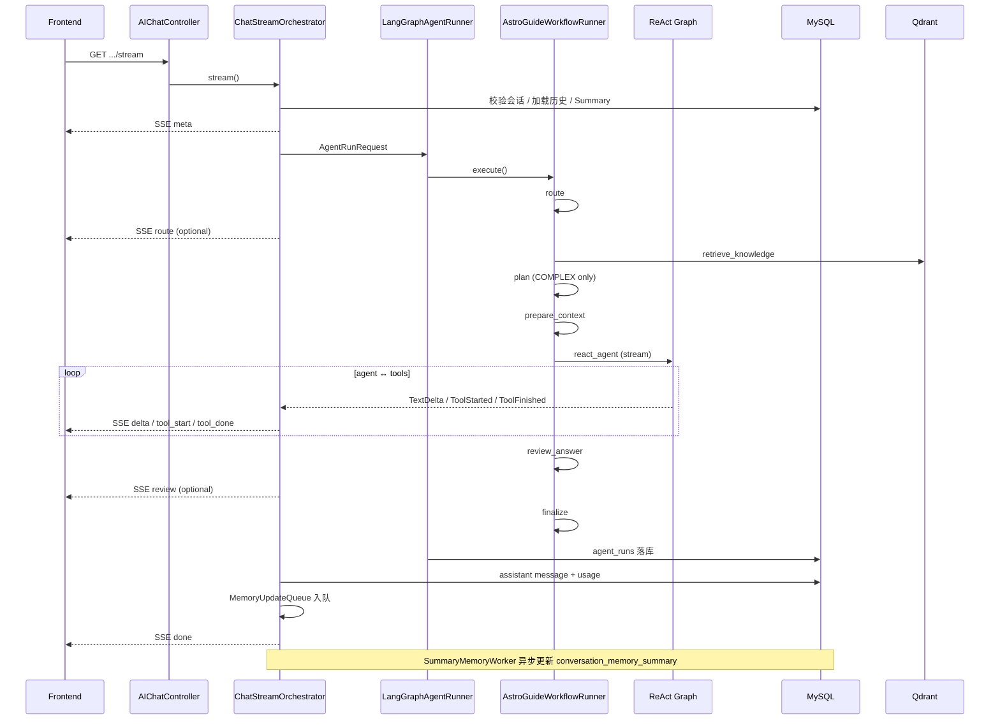
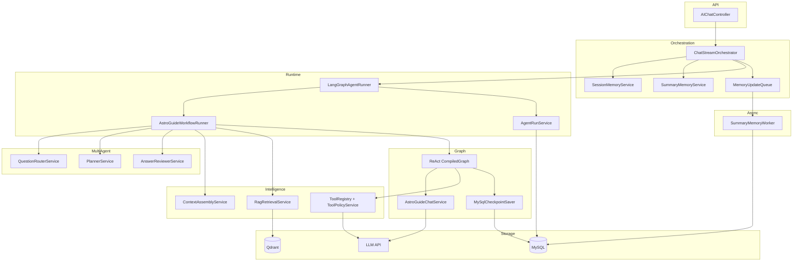

# AstroGuide 后端整体架构图

> 更新：2026-06-28  
> 当前版本：**LangGraph4j Agent Runtime（Phase 3）** — Multi-Agent 路由 + ReAct 子图 + Summary Memory + 可观测 SSE

---

## 1. 系统上下文

```text
Browser (Vue 3)
  │  REST  /api/v0/conversations, messages, concept-cards, ingest
  │  SSE   /api/v0/conversations/{id}/messages/{id}/stream
  ▼
Spring Boot Backend (Java 21)
  │  ChatStreamOrchestrator ──► AgentRuntime (LangGraphAgentRunner)
  │  Policy (rate-limit / output-limit)
  ▼
┌─────────────────────────────────────────────────────────────┐
│  MySQL          Qdrant (VectorStore)    LLM / Embedding API │
│  conversations  astro_knowledge           OpenAI-compatible │
│  messages       ↑ ingest 离线写入          DeepSeek 等       │
│  agent_runs                                                 │
│  agent_checkpoints                                          │
│  conversation_memory_summary                                │
└─────────────────────────────────────────────────────────────┘
         ▲
         │  Wikipedia / ConceptCard（Tool 按需调用）
         └─ MediaWiki REST API
```

---

## 2. 逻辑分层

```text
┌──────────────────────────────────────────────────────────────┐
│ API Layer                                                    │
│   AIChatController / ConversationController / MessageController│
│   ConceptCardsController / IngestController                  │
│   SSE Protocol: meta | delta | node_* | tool_* | route |     │
│                 review | done | error                        │
├──────────────────────────────────────────────────────────────┤
│ Orchestration Layer                                          │
│   ChatStreamOrchestrator                                     │
│     ├─ 鉴权 / 限流 / 会话校验                                 │
│     ├─ SessionMemory + SummaryMemory 加载                    │
│     ├─ AgentRuntime.stream()                                 │
│     └─ 落库 assistant + usage + 异步 Summary 入队             │
├──────────────────────────────────────────────────────────────┤
│ Agent Runtime Layer                                          │
│   LangGraphAgentRunner                                       │
│     └─ AstroGuideWorkflowRunner（Phase 3 工作流）             │
│          route → retrieve → [plan] → prepare → react →       │
│          review → finalize                                   │
│     └─ AgentRunService（run 生命周期 + 审计）                 │
├──────────────────────────────────────────────────────────────┤
│ Intelligence Layer                                           │
│   multiagent/   QuestionRouter / Planner / Reviewer          │
│   context/      ContextAssembly + Trim + TokenBudget         │
│   rag/          RagRetrievalService                          │
│   graph/        LangGraph ReAct 子图 + MySqlCheckpointSaver  │
│   tool/         ToolRegistry + ToolPolicyService             │
│   memory/       Session / Summary / MemoryUpdateQueue        │
├──────────────────────────────────────────────────────────────┤
│ Infrastructure Layer                                         │
│   MySQL · Qdrant · Micrometer Metrics · AsyncConfig          │
└──────────────────────────────────────────────────────────────┘
```

---

## 3. Phase 3 工作流

```text
route ──► retrieve_knowledge ──► [plan] ──► prepare_context ──► react_agent ──► review_answer ──► finalize
  │              │                  ↑              ↑                  │
  │              │           COMPLEX 才走      注入 RAG + Summary      │
  │              │           Planner           + Plan + History       │
  │              │                                                      │
  └─ SIMPLE / COMPLEX 分流                              LangGraph ReAct 子图
                                                        (agent ↔ tools 循环)
```

| 路径 | 触发条件 | 额外 LLM 调用 |
|------|----------|---------------|
| **SIMPLE** | 短问题、单问、无复杂关键词 | 无 |
| **COMPLEX** | 长文本 / 多问 / 对比分析关键词 | Planner + Reviewer（LLM） |

| 节点 | 模块 | 职责 |
|------|------|------|
| `route` | `QuestionRouterService` | 按复杂度分流 SIMPLE / COMPLEX |
| `retrieve_knowledge` | `RagRetrievalService` | Qdrant 向量检索，产出 citations |
| `plan` | `PlannerService` | 复杂问题生成执行计划（仅 COMPLEX） |
| `prepare_context` | `ContextAssemblyService` | 组装 System + 历史 + RAG + Summary + Plan |
| `react_agent` | `AgentGraphConfig` → ReAct 子图 | 流式推理 + Tool Calling 循环 |
| `review_answer` | `AnswerReviewerService` | 规则校验 + 复杂路径 LLM 修订 |
| `finalize` | WorkflowRunner | 合并 citations / tool 记录 / token 统计 |

---

## 4. ReAct 子图（LangGraph4j）

```text
                    ┌─────────────┐
                    │   agent     │◄──────────────────┐
                    │ (ChatModel) │                   │
                    └──────┬──────┘                   │
                           │ tool_calls?              │ tool results
                           ▼                          │
                    ┌─────────────┐            ┌──────┴──────┐
                    │   tools     │───────────►│  ToolRegistry│
                    │  (execute)  │            │  + Policy    │
                    └─────────────┘            └─────────────┘
                           │ no tool_calls
                           ▼
                      final answer

Checkpoint: MySqlCheckpointSaver → agent_checkpoints（step 级快照，支持恢复）
Recursion limit: app.ai.runtime.recursion-limit（默认 12）
```

**已注册 Tool（Spring AI `@Tool`）：**

| Tool | 实现类 | 说明 |
|------|--------|------|
| `search_wikipedia` | `WikipediaTool` | MediaWiki REST 摘要检索 |
| `search_knowledge_base` | `KnowledgeBaseTool` | Qdrant 追加检索 |
| `lookup_concept_card` | `ConceptCardTool` | 术语 / 符号概念卡 |

**Tool 治理（`ToolPolicyService`）：**

- 单次 run 总调用上限：`app.ai.tools.max-calls-total`
- 单工具调用上限：`app.ai.tools.max-calls-per-tool`
- 超时：`app.ai.tools.timeout-ms`
- 包装：`PolicyEnforcingToolCallback` 审计 + 限次

---

## 5. 单次问答时序


```mermaid
sequenceDiagram
  participant FE as Frontend
  participant Ctrl as AIChatController
  participant Orch as ChatStreamOrchestrator
  participant RT as LangGraphAgentRunner
  participant WF as AstroGuideWorkflowRunner
  participant RG as ReAct Graph
  participant DB as MySQL
  participant QD as Qdrant

  FE->>Ctrl: GET .../stream
  Ctrl->>Orch: stream()
  Orch->>DB: 校验会话 / 加载历史 / Summary
  Orch-->>FE: SSE meta
  Orch->>RT: AgentRunRequest
  RT->>WF: execute()
  WF->>WF: route
  Orch-->>FE: SSE route (optional)
  WF->>QD: retrieve_knowledge
  WF->>WF: plan (COMPLEX only)
  WF->>WF: prepare_context
  WF->>RG: react_agent (stream)
  loop agent ↔ tools
    RG-->>Orch: TextDelta / ToolStarted / ToolFinished
    Orch-->>FE: SSE delta / tool_start / tool_done
  end
  WF->>WF: review_answer
  Orch-->>FE: SSE review (optional)
  WF->>WF: finalize
  RT->>DB: agent_runs 落库
  Orch->>DB: assistant message + usage
  Orch->>Orch: MemoryUpdateQueue 入队
  Orch-->>FE: SSE done
  Note over Orch,DB: SummaryMemoryWorker 异步更新 conversation_memory_summary
```

---

## 6. Memory 分层

```text
Working Memory    → LangGraph State.messages（当前 run 内消息）
Session Memory    → SessionMemoryService（MySQL 最近 N 条，app.ai.memory.max-messages）
Summary Memory    → conversation_memory_summary（异步 Worker 滚动摘要）
Checkpoint        → agent_checkpoints（ReAct 子图 step 级快照）
Run Audit         → agent_runs（每次 run 的 token / route / review / tool 统计）
```

**异步 Summary 链路：**

```text
ChatStreamOrchestrator ──► MemoryUpdateQueue（防抖合并）
                                │
                                ▼
                         SummaryMemoryWorker (@Async)
                                │
                                ▼
                         conversation_memory_summary
```

---

## 7. SSE 事件协议

| 事件 | 开关 | 说明 |
|------|------|------|
| `meta` | 始终 | requestId, conversationId, messageId, runId |
| `delta` | 始终 | `{ "text": "..." }` 流式文本 |
| `node_start` / `node_done` | `app.ai.runtime.emit-node-events` | 工作流节点开始 / 结束 + latencyMs |
| `tool_start` / `tool_done` | `app.ai.runtime.emit-tool-events` | Tool 调用过程 |
| `route` | `app.ai.runtime.emit-route-events` | mode, reasonCode, confidence |
| `review` | `app.ai.runtime.emit-route-events` | passed, reasonCode, revised(optional) |
| `done` | 始终 | usage, citations, runId, route, review, toolCalls |
| `error` | 始终 | code, message, requestId |

---

## 8. 组件依赖图


```mermaid
flowchart TB
  subgraph API
    Ctrl[AIChatController]
  end

  subgraph Orchestration
    Orch[ChatStreamOrchestrator]
    SessionMem[SessionMemoryService]
    SummaryMem[SummaryMemoryService]
    MemQueue[MemoryUpdateQueue]
  end

  subgraph Runtime
    AgentRT[LangGraphAgentRunner]
    AgentRunSvc[AgentRunService]
    WF[AstroGuideWorkflowRunner]
  end

  subgraph MultiAgent
    Router[QuestionRouterService]
    Planner[PlannerService]
    Reviewer[AnswerReviewerService]
  end

  subgraph Graph
    ReactGraph[ReAct CompiledGraph]
    Checkpoint[MySqlCheckpointSaver]
    ChatSvc[AstroGuideChatService]
  end

  subgraph Intelligence
    Context[ContextAssemblyService]
    RAG[RagRetrievalService]
    Tools[ToolRegistry + ToolPolicyService]
  end

  subgraph Async
    Worker[SummaryMemoryWorker]
  end

  subgraph Storage
    MySQL[(MySQL)]
    Qdrant[(Qdrant)]
    LLM[LLM API]
  end

  Ctrl --> Orch
  Orch --> SessionMem
  Orch --> SummaryMem
  Orch --> AgentRT
  Orch --> MemQueue
  MemQueue --> Worker
  Worker --> MySQL

  AgentRT --> WF
  AgentRT --> AgentRunSvc
  AgentRunSvc --> MySQL

  WF --> Router
  WF --> Planner
  WF --> Reviewer
  WF --> Context
  WF --> RAG
  WF --> ReactGraph

  ReactGraph --> ChatSvc
  ReactGraph --> Tools
  ReactGraph --> Checkpoint
  Checkpoint --> MySQL
  ChatSvc --> LLM
  RAG --> Qdrant
  Tools --> LLM
```

---

## 9. 代码模块映射

| 包路径 | 职责 |
|--------|------|
| `controller/` | REST + SSE 入口 |
| `ai/orchestrator/` | SSE 编排、落库、事件映射 |
| `ai/runtime/` | AgentRuntime 接口、LangGraphAgentRunner、StreamEvent |
| `ai/graph/` | WorkflowRunner、ReAct 子图配置、Checkpoint |
| `ai/multiagent/` | Router / Planner / Reviewer |
| `ai/context/` | 上下文组装、裁剪、Token 估算 |
| `ai/rag/` | RAG 检索 |
| `ai/tool/` | ToolRegistry、Policy、执行审计 |
| `ai/tools/` | Wikipedia / KB / ConceptCard 具体 Tool |
| `ai/memory/` | Session / Summary / 异步队列与 Worker |
| `service/AgentRunService` | run 生命周期持久化 |
| `config/AsyncConfig` | Summary Worker 线程池 |

---

## 10. 数据库（Agent 相关）

| 表 | 用途 |
|----|------|
| `agent_runs` | 每次 Agent run 的状态、token、route、review、耗时 |
| `agent_checkpoints` | LangGraph ReAct 子图 step 级 checkpoint |
| `conversation_memory_summary` | 会话滚动摘要 |

迁移脚本（已有库增量执行）：

- `database/migration-agent-runs.sql`
- `database/migration-agent-checkpoints.sql`
- `database/migration-conversation-memory-summary.sql`

完整 schema：`database/schema-mysql.sql`

---

## 11. 关键配置（application.yaml）

```yaml
app:
  ai:
    tools:
      enabled: true
      timeout-ms: 3000
      max-calls-total: 4
      max-calls-per-tool: 2
    runtime:
      mode: langgraph
      recursion-limit: 12
      emit-node-events: true
      emit-tool-events: true
      emit-route-events: true
    context:
      max-rounds: 8
      max-history-chars: 12000
    memory:
      max-messages: 16
      summary-debounce-ms: 5000
      summary-min-messages: 6
      summary-window: 24
    router:
      enabled: true
      complex-min-chars: 120
      multi-question-threshold: 2
    planner:
      enabled: true
    reviewer:
      enabled: true
      llm-for-complex: true
      min-answer-chars: 40
  rag:
    enabled: false   # 开启后 retrieve_knowledge 节点生效
    top-k: 8
```

默认端口：`8093`（见 `server.port`）

---

## 12. 版本演进（架构里程碑）

```text
V0   固定 LLM 流式问答                    SQLite → MySQL
V1   RAG Advisor + Wikipedia 固定管线       Qdrant + Embedding
V1.5 Spring AI @Tool 工具调用              Wikipedia/KB/ConceptCard
V2   LangGraph4j Agent Runtime             Workflow + ReAct 子图 + Checkpoint
Phase 3  Multi-Agent + Summary Memory       Router/Planner/Reviewer + 异步摘要
```

> 历史设计文档（V0/V1/V1.5/V2 TDD）保留演进记录；**以本文与代码为准**描述当前实现。

---

## 13. 关联文档

- [AstroGuide-V1-技术设计文档.md](./AstroGuide-V1-技术设计文档.md) — RAG 与固定管线（V1 基线）
- [AstroGuide-V1.5-技术设计文档（Agent）.md](./AstroGuide-V1.5-技术设计文档（Agent）.md) — Tool Calling 设计
- [AstroGuide-V2-技术设计文档（Agent工程化）.md](./AstroGuide-V2-技术设计文档（Agent工程化）.md) — 工程化路线图
- [API 接口文档](./API-接口文档（含 ApiFox 测试方法）.md)
