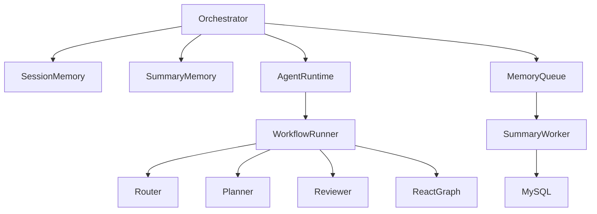

# AstroGuide 后端整体架构图（Phase 3 / Multi-Agent + Summary Memory）

> 目标：看清请求如何进入 → Router 分流 → Workflow 编排 → ReAct 子图 → Reviewer → SSE → 异步 Summary Memory。

## 1) Phase 3 Workflow

```text
route → retrieve_knowledge → [plan] → prepare_context → react_agent → review_answer → finalize
         ↑ COMPLEX 才走 plan     ↑ 注入 Summary + Plan
```

| 路径 | 触发条件 | 额外 LLM 调用 |
|------|----------|---------------|
| SIMPLE | 短问题、单问、无复杂关键词 | 无 |
| COMPLEX | 长文本 / 多问 / 对比分析关键词 | Planner + Reviewer(LLM) |

## 2) 新增模块

| 能力 | 模块 | 说明 |
|------|------|------|
| Multi-Agent Router | `QuestionRouterService` | 按复杂度分流 SIMPLE / COMPLEX |
| Planner | `PlannerService` | 复杂问题生成执行计划 |
| Reviewer | `AnswerReviewerService` | 规则校验 + 复杂路径 LLM 修订 |
| Summary Memory | `SummaryMemoryService` + `SummaryMemoryWorker` | 异步滚动摘要 |
| Memory Queue | `MemoryUpdateQueue` | 防抖合并，不阻塞 SSE |

## 3) Memory 分层（Phase 3）

```text
Working Memory   → LangGraph State.messages（当前 run）
Session Memory   → SessionMemoryService（MySQL 最近 N 条）
Summary Memory   → conversation_memory_summary（异步 Worker 更新）
Checkpoint       → agent_checkpoints（step 级快照）
```

## 4) SSE 事件（Phase 3 新增）

| 事件 | 说明 |
|------|------|
| `route` | mode=SIMPLE\|COMPLEX, reasonCode, confidence |
| `review` | passed, reasonCode, revised(optional) |
| `done.route` / `done.review` | 终态元数据 |

## 5) 代码入口

| 模块 | 路径 |
|------|------|
| Router / Planner / Reviewer | `ai/multiagent/` |
| Summary Memory | `ai/memory/SummaryMemoryService.java`, `SummaryMemoryWorker.java` |
| Workflow | `ai/graph/AstroGuideWorkflowRunner.java` |
| 异步配置 | `config/AsyncConfig.java` |

## 6) DB 迁移

已有库执行：`database/migration-conversation-memory-summary.sql`

## 7) 配置项（application.yaml）

```yaml
app.ai.router.enabled: true
app.ai.planner.enabled: true
app.ai.reviewer.enabled: true
app.ai.reviewer.llm-for-complex: true
app.ai.memory.summary-debounce-ms: 5000
app.ai.runtime.emit-route-events: true
```

## 8) 组件视图（继承 Phase 2，新增高亮）


```mermaid
flowchart TB
  Orchestrator --> SessionMemory
  Orchestrator --> SummaryMemory
  Orchestrator --> AgentRuntime
  AgentRuntime --> WorkflowRunner
  WorkflowRunner --> Router
  WorkflowRunner --> Planner
  WorkflowRunner --> Reviewer
  WorkflowRunner --> ReactGraph
  Orchestrator --> MemoryQueue
  MemoryQueue --> SummaryWorker
  SummaryWorker --> MySQL
```

> Phase 2 详细组件图与时序见上文历史版本；Phase 3 在 Workflow 层增加 route/plan/review 三节点，在 Memory 层增加 Summary 异步链路。
